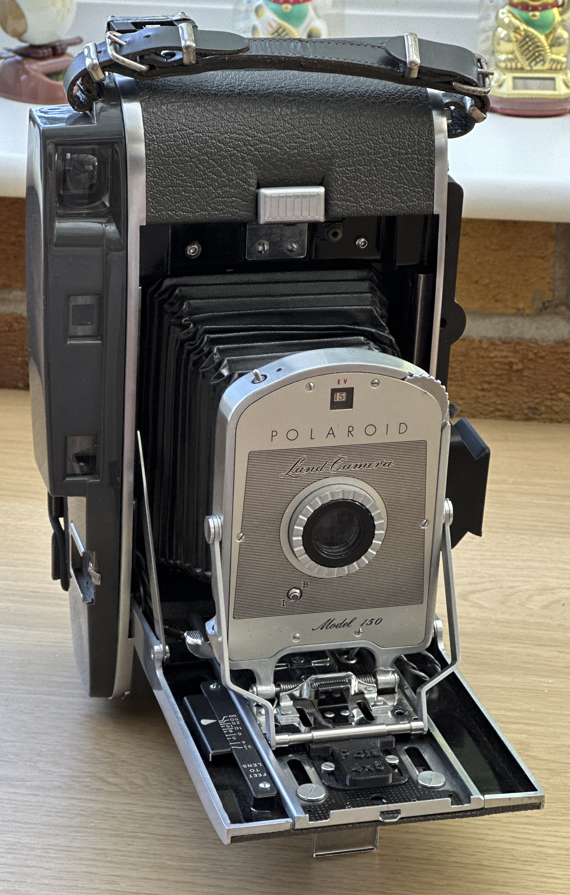
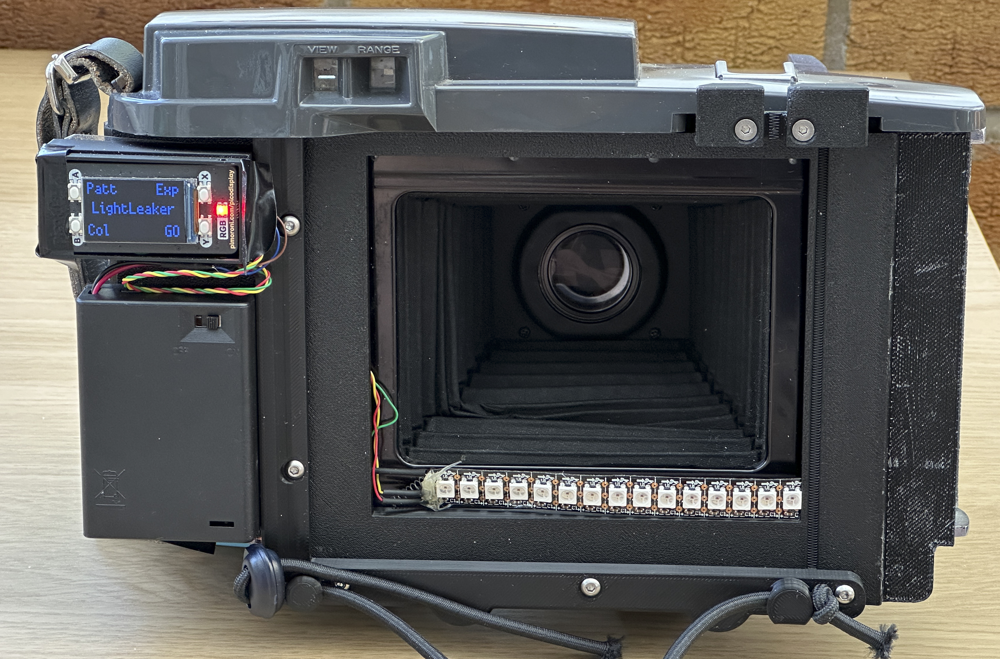

# PICO-Polaroid-camera-light-leaker

On this site you can find instructions on how to convert a Polaroid Land camera (110, 150 or 800) to use sheet film. You can then attach a [LomoGraflok back](https://shop.lomography.com/us/lomograflok-4-5-instant-back) to the camera and use it to take instant pictures on Fuji Film Instax Large film.

Then you can add a Raspberry Pi PICO powered strip of LEDS which can be used to add light leaks and colour casts to pictures that you take. 
## Get a camera
You can get a camera from your favourite online auction site. Search for "Polaroid Land 150".
## Do the conversion
There are two conversions I reccommend:
* Morten Kolve - involves removing the back of the camera and drilling holes in the body. Non-reversable, but easy to attach and detach the LomoGraflok back. You can find instructions [here](https://film.kolve.org/darkroomdiy/polaroid-110-convert-to-4x5/).
* Albert Cornelissen - involves removing the back of the camera but does not need any holes drilling and can be reversed if required. However, this design makes it slightly harder to add and remove the LomoGraflok back. You can find instructions [here](https://cornelissen.me/writing/ph/110conversion.html)
## Add the LEDS
The leds allow you to add lighting effects to pictures that you have taken. This is all very experimental, and might result in you ruining your shots. But then again, the results can be very good too. 

I stuck the leds inside the camera at the base of the frame as you can see. You might want to experiment with other positions and even add some diffusers.
## Install the software
The software runs on a Raspberry Pi PICO using a [PICO Display Pack](https://shop.pimoroni.com/products/pico-display-pack) for the user interface. You can download their MicroPython image from [here](https://github.com/pimoroni/pimoroni-pico/releases). To install the LightLeaker software you can use [Thonny](https://thonny.org/) to copy main.py from this repository onto the PICO. The software shows a user interface which lets you select the different menu options by clicking the four buttons on the PICO Display Pack. 
## Have fun
There are presently two kinds of light leak, the line of leds and just one led. These work well, although different colours produce different leak patterns. You could add some new patterns, perhaps with different coloured leds on the strip and see how these affect the images. 

[Rob Miles](https://www.robmiles.com/) August 2024
